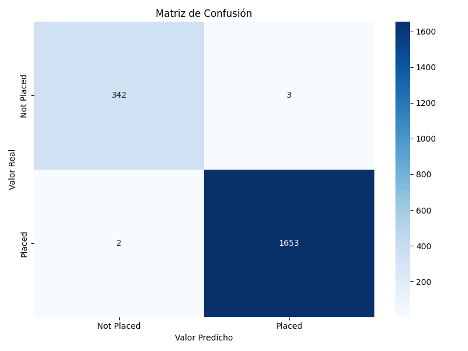
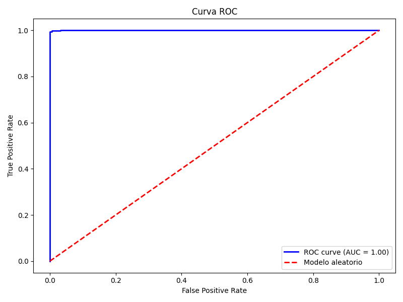
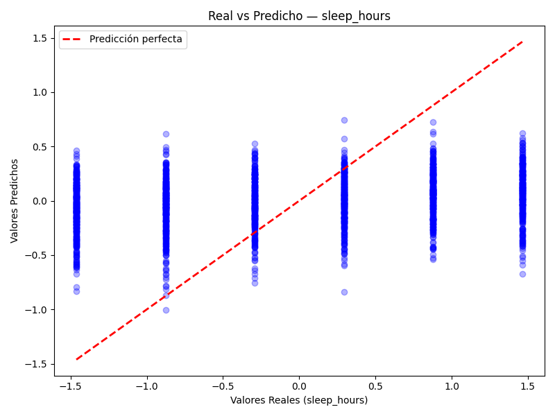

# Pipeline Multi-Agente — Rendimiento Estudiantil

Sistema de análisis de rendimiento estudiantil basado en un pipeline de tres agentes de Machine Learning.

## Descripción
Este proyecto implementa un pipeline multi-agente que analiza un dataset de 10,000 estudiantes para predecir su éxito laboral y analizar el impacto de los hábitos de sueño en su rendimiento académico.

## Estructura del Proyecto

```
Boot-con-Mistral.ia/
├── Agentes/
│   ├── tres_agentes.py
│   └── imagenes/
│       ├── matriz_confusion.png
│       ├── curva_roc.png
│       └── real_vs_predicho.png
├── README.md
└── Boot_Mistral.ipynb
```

## Pipeline

```
Dataset CSV (10,000 estudiantes)
        ↓
Agente 1 — Normalizador
        ↓ dataset limpio
Agente 2 — Entrenador
        ↓ métricas + modelos
Agente 3 — Comunicador
        ↓ reporte en lenguaje natural
```

## Agentes

### Agente 1 — Normalizador
Prepara el dataset para el entrenamiento:
- Limpieza e imputación de valores nulos
- Codificación de variables categóricas (`placement_status` → 0/1)
- Escalado de features con `StandardScaler`
- Exporta `dataset_limpio.csv`

### Agente 2 — Entrenador
Entrena y evalúa dos modelos:
- División 80% entrenamiento / 20% prueba
- Entrena **Modelo 1** (Regresión Logística) y **Modelo 2** (Regresión Lineal)
- Genera matriz de confusión y curva ROC
- Exporta `modelo_entrenado.pkl`

### Agente 3 — Comunicador
Genera reporte en lenguaje natural con los resultados de ambos modelos.

## Dataset
----------------------------------------------------------------------------------
|       Columna           | Tipo   | Descripción                                 |
|-------------------------|--------|---------------------------------------------|
| `study_hours`           | int    | Horas de estudio                            |
| `attendance`            | int    | Porcentaje de asistencia                    |
| `sleep_hours`           | int    | Horas de sueño                              |
| `internet_usage`        | int    | Uso de internet                             |
| `assignments_completed` | int    | Tareas completadas                          |
| `previous_score`        | int    | Puntaje previo                              |
| `exam_score`            | float  | Puntaje del examen                          |
| `placement_status`      | object | **Variable objetivo** (Placed / Not Placed) |
----------------------------------------------------------------------------------
##  Resultados

### Modelo 1 — ¿Consiguen trabajo los estudiantes?
**Algoritmo:** Regresión Logística
--------------------------
|  Métrica  |    Valor   |
|-----------|------------|
| Accuracy  | 99.75%     |
| Precisión | 99% - 100% |
| Recall    | 99% - 100% |
| AUC-ROC   | 1.00       |
--------------------------

**Distribución:**
- Estudiantes colocados (Placed): 1,655 (82.8%)
- Estudiantes no colocados (Not Placed): 345 (17.2%)

**Conclusión:** El modelo predice con 99.75% de precisión si un estudiante conseguirá trabajo. Las variables más influyentes son el puntaje del examen y el puntaje previo.

#### Matriz de Confusión


#### Curva ROC


### Modelo 2 — ¿Dormir afecta el rendimiento?
**Algoritmo:** Regresión Lineal

--------------------
| Métrica | Valor  |
|---------|--------|
| R2      | 5.85%  |
| MSE     | 0.9681 |
--------------------

**Conclusión:** Las horas de sueño tienen una relación muy baja (5.85%) con el rendimiento académico. Dormir más o menos no predice significativamente el éxito laboral. Factores externos no capturados en el dataset (estrés, trabajo part-time, hábitos) probablemente influyen más.

#### Real vs Predicho


## Tecnologías

- Python 3
- Google Colab
- pandas, numpy
- scikit-learn
- matplotlib, seaborn
- joblib

##  Cómo ejecutar

1. Abrir `tres_agentes.py` en Google Colab
2. Subir el dataset CSV cuando se solicite
3. Ejecutar las celdas en orden
4. Los resultados se guardan como `dataset_limpio.csv`, `modelo_entrenado.pkl`, `matriz_confusion.png`, `curva_roc.png` y `real_vs_predicho.png`

## Autora

**Milagros Acosta** — [@miliacoss0](https://github.com/miliacoss0)